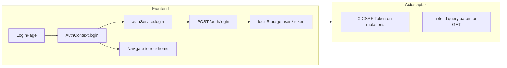
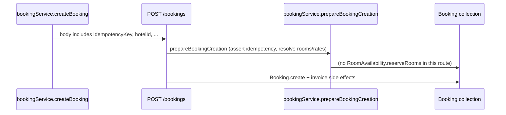

# Full-stack audit findings tracker

**Purpose:** Living document for issues discovered during the frontend–backend audit (Phases 2–6). Each entry is written so a later fix pass is fast: **what**, **where**, **how to correct**, and **how to verify**.

**How to use**

- Add or update rows as soon as an issue is confirmed (do not wait for Phase 6).
- Prefer one issue per row; split if fix/verify steps differ.
- When fixing: change **Status** to `fixed` and add **Verification** (test name or manual step).
- For token-efficient handoff: paste only the **ID** (e.g. `FAB-003`) into follow-up chats.

**Related:** Program-level phase completion lives in `docs/MASTER_PHASE_TRACKER.md`. This file is **code-oriented** and **full-stack specific**.

---

## Phase 2 — Domain flows (diagrams + state checklist)

### Login / session (high level)

### Booking lifecycle (backend state machine)

Valid transitions are defined in `backend/src/utils/bookingStateMachine.js`:

| From | Allowed next |
| --- | --- |
| `pending` | `confirmed`, `cancelled` |
| `confirmed` | `checked_in`, `cancelled`, `no_show`, `modified` |
| `modified` | `confirmed`, `checked_in`, `cancelled`, `no_show` |
| `checked_in` | `checked_out` |
| `checked_out`, `cancelled`, `no_show` | _(terminal)_ |

### Create booking (API path)

### Payments (axios idempotency)

`frontend/src/services/api.ts` adds `Idempotency-Key` only for URL patterns in `IDEMPOTENT_MUTATION_PATTERNS` (payments/invoices). **`/bookings` is not in that list.** Booking deduplication uses **body** `idempotencyKey` via `backend/src/modules/booking/service.js` (`assertIdempotencyIsSafe`).

### Inventory vs booking

- **Admin calendar** writes `RoomAvailability` (inventory routes/controllers).
- **Standard `POST /bookings`** (`backend/src/routes/bookings.js`) runs `prepareBookingCreation` then `Booking.create` inside a transaction; **does not** call `availabilityService.reserveRooms` in the traced handler (lines ~594–775+).
- **Channels / enhanced paths** may call `reserveRooms` (see grep under `enhancedBookingController`, OTA services).

### Phase 2 — Completion verification (was it “really” done?)

Original scope: **flow diagrams + state checklist** for login, booking lifecycle, **payments**, **inventory calendar**, and **how inventory reflects in booking availability**.

| Topic | In this doc? | Honest grade |
| --- | --- | --- |
| Login / session | Mermaid + axios hooks | **Complete** (high level) |
| Booking lifecycle (status transitions) | Table from `bookingStateMachine.js` | **Complete** for allowed transitions |
| Booking creation (API) | Sequence diagram + idempotency note | **Complete** for main `POST /bookings` path |
| **Payments** (Stripe / intent / confirm / refunds) | Only **idempotency** split (axios vs booking body) | **Partial** — not a full payment swimlane; defer detail to Phase 4 (`routes/payments.js`, webhooks) |
| **Inventory calendar** (admin UI → services → `RoomAvailability`) | Short bullets only | **Partial** — no UI→API diagram for `InventoryCalendar` / `inventoryService` |
| Inventory vs booking availability (sync gap) | Narrative + FAB-004/005 | **Complete** as problem statement |

**Conclusion:** Phase 2 is **complete for booking state + create path + the inventory/booking disconnect**. It is **not** a full Phase 2 if you required detailed **payment rail** and **calendar** swimlane diagrams; those can be appended here or in a follow-up pass without reopening Phase 3.

---

## Phase 3 — Per-page audit

### Repeatable checklist (each page)

Use one row in the **Phase 3 route inventory** table, or a short note under the page file.

1. **Route** — path, layout, `ProtectedRoute` roles (from `App.tsx`).
2. **Data sources** — React Query? `useEffect` + service? hardcoded/mock?
3. **APIs called** — list service modules and endpoint paths.
4. **Tenant/property** — uses `selectedPropertyId`, `hotelId` from context, or hardcoded ID?
5. **Mutations** — loading/error/toast; optimistic updates?
6. **Real-time** — socket/SSE/polling?
7. **Gaps** — assign new `FAB-xxx` if confirmed; link here.

### Route inventory (`App.tsx`)

| Area | Approx. leaf routes | Phase 3 status |
| --- | ---: | --- |
| Public (`/`, `/rooms`, …) | 6 | **Complete** — Batch 1 |
| Auth (`/login`, `/register`, `/admin/login`) | 3 | **Complete** — Batch 2 (FAB-009, FAB-010 **fixed**) |
| Guest `/app/*` | 26 | **Complete** — Batches 3–5 (tables below) |
| Admin `/admin/*` | 70+ | **Complete** — Batch 6 (grep + layout sweep) |
| Front desk `/frontdesk/*` | 24 | **Complete** — Batch 7 |
| Staff `/staff/*` | 21 | **Complete** — Batch 8 |
| Travel agent (`/travel-agent/*`) | 10 | **Complete** — Batch 9 |
| Catch-all | 1 | n/a |

**Phase 3 is closed for every route group in `App.tsx`.** Deep **per-endpoint** validation is **Phase 4**; guest flows had the most line-level review; admin/front desk/staff/travel used **automated sweeps** (wrong SPA paths, `user.id` vs `_id`) plus **layout/sidebar** alignment with `/admin`, `/frontdesk`, `/staff`, `/travel-agent` prefixes.

### Batch 1 — Public pages (audited 2025-03-27)

| Route | Page file | APIs / data | Findings |
| --- | --- | --- | --- |
| `/` | `pages/public/HomePage.tsx` | `reviewsService` for reviews summary | **FAB-006** — fixed: `DEFAULT_PUBLIC_HOTEL_ID` + env |
| `/rooms` | `pages/public/RoomsPage.tsx` | Static room cards | **FAB-003** (hardcoded types, no availability) |
| `/rooms/:type` | `pages/public/RoomDetailPage.tsx` | `ROOM_TYPES` constant | Same as FAB-003; no API-backed rates/availability |
| `/booking` | `pages/public/BookingPage.tsx` | `bookingService` | **FAB-003**; uses `createBooking` → **FAB-004/FAB-005** |
| `/contact` | `pages/public/ContactPage.tsx` | `contactService` | OK pattern (validated submit) — no new ID |
| `/reviews` | `pages/public/ReviewsPage.tsx` | `reviewsService` | **FAB-006** — fixed (same as home) |

**Orphan / unreachable UI**

| File | Note |
| --- | --- |
| `pages/public/ImprovedBookingPage.tsx` | **FAB-007** — fixed: `/improved-booking` |
| `pages/guest/GuestSettings.tsx` | **FAB-014** — fixed: `/app/settings/guest` |

### Batch 3 — Guest core (bookings, billing, inventory) (audited 2026-03-27)

Guest shell routes are under **`/app/*`** in `frontend/src/App.tsx`. Several pages still navigate to **`/guest/bookings`** (no matching route → catch-all to `/` or 404).

| Route | Page file | APIs / data | Findings |
| --- | --- | --- | --- |
| `/app` | `pages/guest/GuestDashboard.tsx` | `bookingService.getUserBookings`, `useAuth` | Links use `/app/...` — OK |
| `/app/bookings` | `pages/guest/GuestBookings.tsx` | React Query + `bookingService.getUserBookings` | **FAB-012** — fixed |
| `/app/bookings/:id` | `pages/guest/GuestBookingDetail.tsx` | `GET /bookings/enhanced/:id`, price-history | **FAB-012** — fixed |
| `/app/billing` | `pages/guest/GuestBillingHistory.tsx` | `billingHistoryService` + React Query | OK — no new ID |
| `/app/inventory-requests` | `pages/guest/InventoryRequests.tsx` | `guestServiceService`, `bookingService.getUserBookings` | OK — no new ID |
| (keys CTAs) | `pages/guest/DigitalKeysDashboard.tsx` | (not fully traced this batch) | **FAB-012** — fixed |

### Batch 4 — Guest services, loyalty, notifications, feedback, meet-ups (audited 2026-03-27)

| Route | Page file | APIs / data | Findings |
| --- | --- | --- | --- |
| `/app/loyalty` (+ sub-routes) | `LoyaltyDashboard.tsx`, `LoyaltyTransactions.tsx`, `AllOffers.tsx`, `FavoritesPage.tsx`, `RecommendationsPage.tsx` | loyalty / offers services (not line-audited in depth) | Nav uses `/app/loyalty/...` — OK |
| `/app/services` (+ detail, book, bookings) | `HotelServicesDashboard.tsx`, `ServiceDetailsPage.tsx`, `ServiceBookingPage.tsx`, `MyServiceBookings.tsx` | services APIs | Nav uses `/app/services/...` — OK |
| `/app/services/bookings/confirmation/:id` | `ServiceBookingConfirmation.tsx` | confirmation UI | **FAB-013** — fixed → `/app` |
| `/app/notifications` | `NotificationsDashboard.tsx` | `notificationService` + socket | OK at a glance; deep validation deferred |
| `/app/meet-ups` | `MeetUpRequestsDashboard.tsx` | `meetUpRequestService` | OK at a glance |
| `/app/feedback` | `GuestFeedback.tsx` | `bookingService`, `reviewService` | OK at a glance |
| `/app/documents` | `GuestDocuments.tsx` | document upload | Not traced in depth this batch |
| `/app/settings/*` | `ProfileSettings.tsx`, `PreferencesSettings.tsx`, `PrivacySettings.tsx` | `api` settings endpoints | API paths are backend routes, not SPA `/guest/*` |
| `/app/settings/guest` | `GuestSettings.tsx` | `PUT /guest/settings` | **FAB-014** — fixed |

### Batch 2 — Auth pages (audited; findings in tracker)

| Route | Page file | Notes |
| --- | --- | --- |
| `/login` | `pages/auth/LoginPage.tsx` | Role-based redirect after login; demo credentials shown on screen (demo risk, not FAB unless prod) |
| `/register` | `pages/auth/RegisterPage.tsx` | **FAB-009** — fixed |
| `/admin/login` | `pages/admin/AdminLogin.tsx` | Uses same `AuthContext.login` as main login |

### Batch 5 — Guest mobile app (`/app/mobile-app`)

| Route | Page / component | Findings |
| --- | --- | --- |
| `/app/mobile-app` | `components/guest/ContactlessGuestApp.tsx` (lazy from `App.tsx`) | **FAB-015** — demo banner (API wiring optional) |

### Batch 6 — Admin (`/admin/*`)

| Method | Scope | Result |
| --- | --- | --- |
| Grep | `pages/admin/**` for `/guest/bookings`, `/app/dashboard`, `` `/guest` `` SPA paths | **No hits** — same class of bug as guest not observed |
| Layout | `layouts/components/AdminSidebar.tsx` | Nav `href`s use `/admin/...` prefix consistent with `App.tsx` |
| Note | `pages/admin/` file count vs `App.tsx` lazy imports | **FAB-016** — many `.tsx` files on disk are **not** routed from `App.tsx` (legacy / duplicates) |

### Batch 7 — Front desk (`/frontdesk/*`)

| Method | Scope | Result |
| --- | --- | --- |
| Grep | `pages/frontdesk/**` for broken guest-style paths | **No hits** |
| Layout | `FrontDeskSidebar.tsx`, `FrontDeskHeader.tsx` | Links use `/frontdesk/...` (e.g. my-approvals) |

### Batch 8 — Staff (`/staff/*`)

| Method | Scope | Result |
| --- | --- | --- |
| Grep | `pages/staff/**` for broken guest-style paths | **No hits** |
| Layout | `StaffLayout.tsx` | `navigate(item.href)` — items expected under `/staff` |

### Batch 9 — Travel agent (`/travel-agent/*`)

| Method | Scope | Result |
| --- | --- | --- |
| Grep | `pages/travel-agent/**` for broken guest-style paths | **No hits** |
| Layout | `TravelAgentSidebar.tsx` | Under `/travel-agent`; **FAB-008** fixed (redirects + sidebar) |

---

## Phase 4 — Backend endpoint audit

**Status:** **Breadth complete** — `docs/PHASE4_ENDPOINT_AUDIT.md` covers global stack plus **Batches A–E** (auth/bookings/payments; inventory/availability/rooms; Stripe + OTA webhooks; admin router patterns; remaining mount categories). Line-level review of every admin sub-route and every Batch E router is **deferred** unless a finding warrants it.

**What Phase 4 adds beyond Phase 3:** For each HTTP surface, confirm **mount path** (`registerApiRoutes.js`), **route-level middleware** (`authenticate`, `ensureTenantContext`, `ensurePropertyAccess`, `authorizePolicy`, `validate`, `enforceIdempotency`), and **client response expectations** (nested `data` vs flat `user`).

**Phase 5 (audit track):** See `docs/PHASE5_FULLSTACK_VERIFICATION.md` and `docs/evidence/phase5-verification.json`. Backend unit layout fixed: auth/booking HTTP tests moved to `src/tests/integration/*.integration.test.js`; `npm run test:integration` targets that folder. Run `npm run test:unit`, `npm run test:integration`, and Playwright (`npm run test:e2e`) and append results to the evidence file.

**Phase 6 — Production backlog:** **`docs/PHASE6_PRODUCTION_BACKLOG.md`** — prioritized `FAB-*` items with acceptance criteria and verification (P0–P3).

**Optional Phase 4 follow-ups:** OTA idempotency deep-dive; map high-traffic Phase 3 API calls to explicit matrix rows (listed under “Deferred” in Phase 6 doc).

---

## Phase 6 — Production backlog

**Status:** **Initial backlog published** — `docs/PHASE6_PRODUCTION_BACKLOG.md`.

**Contents:** Open `FAB-*` items are listed in the quick index below; closed items remain in **Detailed findings** with `Status: fixed` and verification notes. See `docs/PHASE6_PRODUCTION_BACKLOG.md` for acceptance criteria.

**Ongoing:** As fixes ship, update the backlog table (or tracker) status to `done` / `fixed` and add verification (test name, PR, or manual step).

---

## Legend

| Field | Meaning |
| --- | --- |
| **ID** | Stable prefix `FAB-` + number (increment). |
| **Phase** | Discovery phase (2–6). |
| **Severity** | `S0` production blocker · `S1` major · `S2` moderate · `S3` minor / UX |
| **Status** | `open` · `in_progress` · `fixed` · `wontfix` · `deferred` |

---

## Quick index (open items)

| ID | Severity | One-line summary | Status |
| --- | --- | --- | --- |
| FAB-004 | S0 | `RoomAvailability` vs `POST /bookings`: no `reserveRooms`; inventory can drift from bookings | open |
| FAB-001 | S1 | UI property switch may not match API tenant (`ensureTenantContext`) | open |
| FAB-003 | S1 | Public rooms/booking UI uses hardcoded room types; not wired to availability APIs | open |
| FAB-005 | S1 | Confirmed: standard `POST /bookings` does not call `reserveRooms` (channels may differ) | open |
| FAB-016 | S3 | Many `pages/admin/*.tsx` files are not imported by `App.tsx` (legacy / unrouted modules) | open |

**Recently fixed (see changelog):** FAB-002, 006, 007, 008, 009, 010, 011, 012, 013, 014, 015 (demo banner + doc), 017.

*(Sort this table: S0 first, then S1, then …)*

---

## Detailed findings

### FAB-001 — Multi-property UI vs enforced tenant on API

| | |
| --- | --- |
| **ID** | FAB-001 |
| **Phase** | 1–2 |
| **Severity** | S1 |
| **Status** | open |

**What**

- Frontend can store/switch `selectedPropertyId` (e.g. `localStorage`, `PropertyContext`, `api.ts` `hotelId` header).
- Backend `ensureTenantContext` (tenant isolation) overrides `req.body` / `req.query` `hotelId` with `req.user.hotelId` from JWT.
- Risk: UI appears to act on property B while API still applies property A for tenant-scoped routes.

**Where**

- `frontend/src/context/PropertyContext.tsx` — selected property.
- `frontend/src/services/api.ts` — `hotelId` injection.
- `backend/src/middleware/tenantIsolation.js` — `ensureTenantContext`.

**How to correct**

- Product decision: either (a) true multi-property staff users need JWT/`/auth/me` to expose allowed properties and a **single source of truth** for active property on the token or server session, or (b) remove/disable property switch for roles that are single-tenant.
- Align API contract: document which routes honor `hotelId` from client vs server; add tests in `backend/src/tests/integration/multiProperty.integration.test.js` for the intended behavior.

**Verification**

- Integration test: user with two properties switches context and hits a tenant-scoped endpoint; assert data scope matches spec.
- Manual: switch property in UI and confirm network tab `hotelId` and response data match.

---

### FAB-002 — Booking idempotency: body vs axios `Idempotency-Key` header

| | |
| --- | --- |
| **ID** | FAB-002 |
| **Phase** | 2–3 |
| **Severity** | S3 |
| **Status** | fixed |

**What**

- `api.ts` `IDEMPOTENT_MUTATION_PATTERNS` does **not** include `POST /bookings`, so the **header** idempotency interceptor does not apply to booking creation.
- Bookings use **body** `idempotencyKey`: `bookingService.createBooking` → `prepareBookingCreation` → `assertIdempotencyIsSafe` + `Booking` uniqueness by key (`backend/src/modules/booking/service.js`, `repository.js`).
- This is a **documentation/clarity** issue, not two competing stores on the same request.

**Where**

- `frontend/src/services/api.ts` — `IDEMPOTENT_MUTATION_PATTERNS`.
- `frontend/src/services/bookingService.ts` — `idempotencyKey` in body.
- `backend/src/modules/booking/service.js` — `buildIdempotencyKey`, `assertIdempotencyIsSafe`.

**How to correct**

- **Done:** Comment above `IDEMPOTENT_MUTATION_PATTERNS` in `frontend/src/services/api.ts` documents body vs header idempotency for bookings.
- Optional: add `/bookings` to header patterns **only if** product wants Redis-level idempotency middleware on that route (would require backend `enforceIdempotency` on `POST /bookings` — avoid double semantics).

**Verification**

- Code review: `api.ts` comment present. Two POSTs with same body `idempotencyKey` → second rejected or returns same booking per `assertIdempotencyIsSafe` behavior.

---

### FAB-003 — Public marketing / booking pages not using live availability

| | |
| --- | --- |
| **ID** | FAB-003 |
| **Phase** | 2 |
| **Severity** | S1 |
| **Status** | open |

**What**

- `RoomsPage` / booking wizard pages use **hardcoded** room types and do not call availability/inventory APIs before user commits to dates.
- Risk: guest sees options that are not sellable; poor alignment with `RoomAvailability` and rate rules.

**Where**

- `frontend/src/pages/public/RoomsPage.tsx`
- `frontend/src/pages/public/BookingPage.tsx` (`/booking`), `ImprovedBookingPage.tsx` (`/improved-booking` — alternate UI, same data gap).

**How to correct**

- Load room types and availability from backend (e.g. availability or inventory endpoints used elsewhere).
- Handle empty/stop-sell states in UI; match hotel’s `hotelId` and date range.

**Verification**

- E2E: set stop-sell or zero availability in admin → public page reflects or blocks booking.
- Manual: compare calendar inventory vs public flow for same dates.

---

### FAB-004 — `RoomAvailability` / calendar vs core booking module

| | |
| --- | --- |
| **ID** | FAB-004 |
| **Phase** | 2 |
| **Severity** | S0 |
| **Status** | open |

**What**

- Inventory calendar and `RoomAvailability` model track sellable inventory.
- Core booking creation under `backend/src/modules/booking/` (searched) does **not** reference `reserveRooms` / `RoomAvailability`.
- `availabilityService.reserveRooms` is used from other flows (e.g. channels, enhanced booking controller).
- Risk: calendar and booking counts diverge (over/under booking, misleading admin view).

**Where**

- `backend/src/modules/booking/` — creation pipeline (e.g. `service.js`, `prepareBookingCreation`).
- `backend/src/services/availabilityService.js` — `reserveRooms` / `releaseRooms`.
- `backend/src/controllers/inventoryController.js` — calendar CRUD.
- `frontend/src/components/inventory/InventoryCalendar.tsx` — admin view.

**How to correct**

- Architecture: choose a **single write path** for “sold” inventory: either every confirmed booking calls `reserveRooms` (or transactional equivalent), or booking is authoritative and `RoomAvailability` is derived/read-only from bookings.
- Implement the chosen path consistently on: create, modify, cancel, no-show, OTA sync.

**Verification**

- Integration: create booking → calendar available count decreases for that room type/date range.
- Cancel → inventory restored per rules.

---

### FAB-005 — `POST /bookings` does not call `reserveRooms` (confirmed)

| | |
| --- | --- |
| **ID** | FAB-005 |
| **Phase** | 2–3 |
| **Severity** | S1 |
| **Status** | open |

**What**

- **Confirmed:** `router.post('/', …)` in `backend/src/routes/bookings.js` runs `prepareBookingCreation` then `Booking.create` (and invoice logic) inside `session.withTransaction`; **no** `availabilityService.reserveRooms` in that handler (reviewed ~594–775+).
- `reserveRooms` still appears in channel/OTA/enhanced flows (e.g. `enhancedBookingController.js`, `bookingComService.js`).

**Where**

- `backend/src/routes/bookings.js` — `POST /` create handler.
- `backend/src/services/availabilityService.js` — `reserveRooms`.

**How to correct**

- Align with **FAB-004**: either add reservation calls to the main booking path (transactionally) or derive inventory from bookings and stop dual writes.

**Verification**

- Code search: `reserveRooms` not invoked from `bookings.js` create block; integration test once architecture is chosen.

---

### FAB-006 — Hardcoded public `HOTEL_ID` (reviews)

| | |
| --- | --- |
| **ID** | FAB-006 |
| **Phase** | 3 |
| **Severity** | S2 |
| **Status** | fixed |

**What**

- `HomePage` and `ReviewsPage` previously used a fixed Mongo id string for `reviewsService` calls.
- In multi-property or white-label deployments, public pages will show the wrong hotel’s reviews or break if that id is absent.

**Where**

- `frontend/src/constants/publicHotel.ts` — `DEFAULT_PUBLIC_HOTEL_ID` from `import.meta.env.VITE_PUBLIC_DEFAULT_HOTEL_ID` with dev fallback.
- `frontend/src/pages/public/HomePage.tsx`, `ReviewsPage.tsx` — use that constant.

**How to correct**

- **Done:** `VITE_PUBLIC_DEFAULT_HOTEL_ID` in `.env.example`; per-deploy override. (Subdomain/bootstrap API still optional.)

**Verification**

- Set `VITE_PUBLIC_DEFAULT_HOTEL_ID` → reviews/home use that id; document in deploy checklist.

---

### FAB-007 — `ImprovedBookingPage` not routed

| | |
| --- | --- |
| **ID** | FAB-007 |
| **Phase** | 3 |
| **Severity** | S3 |
| **Status** | fixed |

**What**

- `ImprovedBookingPage` was not routed from `App.tsx`.

**Where**

- `frontend/src/App.tsx` — lazy route **`/improved-booking`** → `ImprovedBookingPage`.

**How to correct**

- **Done:** Public route added alongside canonical `/booking`.

**Verification**

- Navigate to `/improved-booking` → page loads.

---

### FAB-008 — Travel agent duplicate dashboard routes

| | |
| --- | --- |
| **ID** | FAB-008 |
| **Phase** | 3 |
| **Severity** | S3 |
| **Status** | fixed |

**What**

- Duplicate paths `/travel-agent/dashboard` and `/travel-agent/bookings` both rendered the same screen.

**Where**

- `frontend/src/App.tsx` — `Navigate` to `/travel-agent`.
- `frontend/src/layouts/components/TravelAgentSidebar.tsx` — “My Bookings” → `/travel-agent`.

**How to correct**

- **Done:** Redirect duplicates to canonical `/travel-agent`; align sidebar.

**Verification**

- Open `/travel-agent/bookings` → lands on `/travel-agent`.

---

### FAB-009 — `RegisterPage` unused `authService` import

| | |
| --- | --- |
| **ID** | FAB-009 |
| **Phase** | 3 |
| **Severity** | S3 |
| **Status** | fixed |

**What**

- `RegisterPage.tsx` imported `authService` but never used it.
- If the repo uses strict TypeScript or lint (`noUnusedLocals` / ESLint), this can fail CI/build.

**Where**

- `frontend/src/pages/auth/RegisterPage.tsx`

**How to correct**

- **Done:** Unused import removed.

**Verification**

- `npm run build` / `npm run lint` clean.

---

### FAB-010 — Duplicate `/auth/me` calls (AuthProvider + PropertyProvider)

| | |
| --- | --- |
| **ID** | FAB-010 |
| **Phase** | 3 |
| **Severity** | S2 |
| **Status** | fixed |

**What**

- `AuthContext` and `PropertyContext` both triggered `/auth/me` on startup.

**Where**

- `frontend/src/context/AuthContext.tsx` — `AUTH_ME_QUERY_KEY`, `initializeAuth` uses `queryClient.fetchQuery`.
- `frontend/src/context/PropertyContext.tsx` — `useAuth()` + optional `GET /admin/hotels/:id` when needed.

**How to correct**

- **Done:** Single React Query key for `/auth/me`; property list derived from auth user when possible.

**Verification**

- Network tab on cold load: one `/auth/me` (plus optional admin hotel fetch when applicable).

---

### FAB-011 — Guest real-time updates filtered with `user.id` (should be `_id`)

| | |
| --- | --- |
| **ID** | FAB-011 |
| **Phase** | 3 |
| **Severity** | S1 |
| **Status** | fixed |

**What**

- `GuestRequests.tsx` filtered socket updates with `user.id` instead of `user._id`.
- The filter compares `updatedRequest.userId?._id === user.id` and `updatedRequest.userId === user.id`.
- The auth model uses `user._id` (see `frontend/src/types/auth.ts`), so `user.id` is likely undefined.
- Result: guest requests may not update (or toasts may not fire) when events arrive.

**Where**

- `frontend/src/pages/guest/GuestRequests.tsx`

**How to correct**

- **Done:** `isSameUserId` / `user._id` used consistently.

**Verification**

- Guest + staff update flow: real-time updates and toasts work.

---

### FAB-012 — Wrong guest URL prefix (`/guest/bookings` vs `/app/bookings`)

| | |
| --- | --- |
| **ID** | FAB-012 |
| **Phase** | 3 |
| **Severity** | S1 |
| **Status** | fixed |

**What**

- Guest shell lives under **`/app`**; links must use **`/app/bookings`**, not `/guest/bookings`.

**Where** *(original bug locations; now fixed)*

- `GuestBookings.tsx`, `GuestBookingDetail.tsx`, `DigitalKeysDashboard.tsx` — were using `/guest/bookings*`.

**How to correct**

- **Done:** Nav targets use `/app/bookings` and `/app/bookings/:id`.

**Verification**

- `rg "/guest/bookings" frontend/src` → no guest-flow hits (or documented exceptions).

---

### FAB-013 — `ServiceBookingConfirmation` navigates to non-existent `/app/dashboard`

| | |
| --- | --- |
| **ID** | FAB-013 |
| **Phase** | 3 |
| **Severity** | S2 |
| **Status** | fixed |

**What**

- “Go to Dashboard” must target **`/app`**, not `/app/dashboard`.

**Where**

- `ServiceBookingConfirmation.tsx` — CTA *(fixed)*.

**How to correct**

- **Done:** `navigate('/app')`.

**Verification**

- Confirmation CTA → `/app`.

---

### FAB-014 — `GuestSettings.tsx` not routed + back navigates to `/guest`

| | |
| --- | --- |
| **ID** | FAB-014 |
| **Phase** | 3 |
| **Severity** | S3 |
| **Status** | fixed |

**What**

- `GuestSettings.tsx` is **not** imported in `frontend/src/App.tsx` (grep only finds the file itself) — unreachable unless linked from elsewhere.
- Back button uses `navigate('/guest')`, but the guest SPA lives under **`/app`**, not `/guest`.

**Where**

- `frontend/src/pages/guest/GuestSettings.tsx`

**How to correct**

- **Done:** Route `/app/settings/guest` in `App.tsx`; back `navigate('/app')`.

**Verification**

- Open `/app/settings/guest`; Back → `/app`.

---

### FAB-015 — Contactless guest “mobile app” page has no backend integration

| | |
| --- | --- |
| **ID** | FAB-015 |
| **Phase** | 3 |
| **Severity** | S2 |
| **Status** | fixed |

**What**

- `/app/mobile-app` (`ContactlessGuestApp`) had no API integration (mock UI).

**Where**

- `frontend/src/components/guest/ContactlessGuestApp.tsx` — demo **Alert** at top.
- Full API wiring remains optional product work.

**How to correct**

- **Done (scope):** Marked as demo/mock in UI. Optional: wire APIs or hide from production nav.

**Verification**

- Page shows explicit demo notice; product signoff if hiding nav in prod.

---

### FAB-016 — Unrouted admin page modules (`pages/admin/` vs `App.tsx`)

| | |
| --- | --- |
| **ID** | FAB-016 |
| **Phase** | 3 |
| **Severity** | S3 |
| **Status** | open |

**What**

- `frontend/src/pages/admin/` contains **many** more `.tsx` files than are lazy-imported in `App.tsx` (only a subset is routed).
- Risk: dead code, duplicate experiments (e.g. `WalkInBooking_FIXED.tsx`), or confusion about canonical screens.

**Where**

- Compare glob `frontend/src/pages/admin/**/*.tsx` vs `grep import.*pages/admin` in `App.tsx`.

**How to correct**

- Inventory: list files with no import path from `App.tsx` or other routed components; delete, merge, or document as internal-only.

**Verification**

- Build/bundle does not rely on deleted files; E2E still covers all menu items in `AdminSidebar`.

---

### FAB-017 — Public availability endpoints without mandatory `hotelId` (cross-property aggregation)

| | |
| --- | --- |
| **ID** | FAB-017 |
| **Phase** | 4 |
| **Severity** | S1 |
| **Status** | fixed |

**What**

- `availabilityService.checkAvailability` only applies `hotelId` to the `Room` query when the parameter is set; **booking overlap** queries were not hotel-scoped. Unauthenticated `GET /availability/*` handlers could omit `hotelId`, causing **incorrect availability** (aggregating across properties) and **information exposure** (room lists spanning tenants) in multi-hotel deployments.

**Where**

- `backend/src/controllers/availabilityController.js` — `requireQueryHotelId` on public read handlers.
- `backend/src/services/availabilityService.js` — `findAlternativeRooms(..., hotelId)`, `handleOverbooking(..., hotelId)`.
- `frontend/src/services/availabilityService.ts` — `GET /availability/check`, `hotelId` on `findAlternatives` / `checkOverbooking`.
- `frontend/src/components/admin/OverbookingConfiguration.tsx` — passes `hotelId` into `checkOverbooking`.

**How to correct**

- **Done:** Require `hotelId` query parameter (400 if missing) on the affected handlers; pass `hotelId` through alternatives and overbooking service paths; align frontend URLs with `GET /availability/check`.

**Verification**

- Call `GET /api/v1/availability/check` without `hotelId` → **400** with `hotelId is required`.
- Call with valid `hotelId` + dates → 200 and only rooms for that property.

---

## Changelog

| Date | Change |
| --- | --- |
| 2025-03-27 | Initial tracker created; seeded FAB-001–FAB-005 from Phase 1–2 audit. |
| 2025-03-27 | Phase 2 diagrams + state checklist; Phase 3 checklist, route inventory, Batch 1 public audit; FAB-002/FAB-005 refined; added FAB-006–FAB-008. |
| 2025-03-27 | Added **Phase 2 completion verification** table (what is fully vs partially documented). |
| 2026-03-27 | Phase 3 Batch 2 audit: added FAB-009 (unused import), FAB-010 (duplicate `/auth/me`), and FAB-011 (GuestRequests `user.id` filter). |
| 2026-03-27 | Phase 3 Batch 3: guest core table + **FAB-012** (`/guest/bookings` vs `/app/bookings`). |
| 2026-03-27 | Phase 3 Batch 4: loyalty/services/notifications/feedback/confirmation + **FAB-013** (`/app/dashboard`), **FAB-014** (`GuestSettings` unrouted + `/guest`). |
| 2026-03-27 | Phase 3 **all batches complete**: Batches 5–9 (guest mobile, admin, front desk, staff, travel agent) + **FAB-015** (ContactlessGuestApp mock), **FAB-016** (unrouted admin files). |
| 2026-03-27 | **Phase 4 started**: `docs/PHASE4_ENDPOINT_AUDIT.md` + Phase 4 section in this tracker (Batch A: auth, bookings, payments). |
| 2026-03-27 | Phase 4 continued: Batch A auth **refresh/logout**; **Batch B** inventory / availability / rooms; **Batch C** Stripe + OTA webhooks. |
| 2026-03-27 | **FAB-017 fixed**: mandatory `hotelId` on public availability reads + frontend `/availability/check`; see Phase 4 doc. |
| 2026-03-27 | **Phase 5 (audit):** `docs/PHASE5_FULLSTACK_VERIFICATION.md`, `docs/evidence/phase5-verification.json`; integration tests reorganized; `test:integration:gate` = multiProperty; CI updated. |
| 2026-03-27 | **Phase 6 started:** `docs/PHASE6_PRODUCTION_BACKLOG.md` (prioritized backlog + acceptance criteria). |
| 2026-03-27 | **Phase 6 fixes:** FAB-009, FAB-011, FAB-012, FAB-013 (RegisterPage import; GuestRequests `user._id`; `/app/bookings`; confirmation → `/app`). |
| 2026-03-27 | **Phase 6 batch 2:** FAB-002 (api.ts idempotency comment); FAB-006 (`VITE_PUBLIC_DEFAULT_HOTEL_ID` + `constants/publicHotel.ts`); FAB-007 (`/improved-booking` route); FAB-008 (travel-agent `Navigate` + sidebar); FAB-010 (`fetchQuery` + `AUTH_ME_QUERY_KEY`, PropertyContext uses `useAuth` + optional admin hotel fetch); FAB-014 (`/app/settings/guest`); FAB-015 (ContactlessGuestApp demo banner); Overbooking/AdminWebSettings remove fake hotel fallbacks. |
| 2026-03-27 | **Large-scope implementation:** `docs/FAB_LARGE_WORK_PLANS.md` — FAB-001 (tenant mismatch banner + context fields); FAB-003 (public catalog via `/room-types/hotel/:id/options`, Rooms/Detail/Booking); FAB-004/005 (`reserveRoomsWithParentSession` after `Booking.create` when `roomIds` resolved; `bookRooms` session save); FAB-016 (`scripts/list-unrouted-admin-pages.cjs`). |
